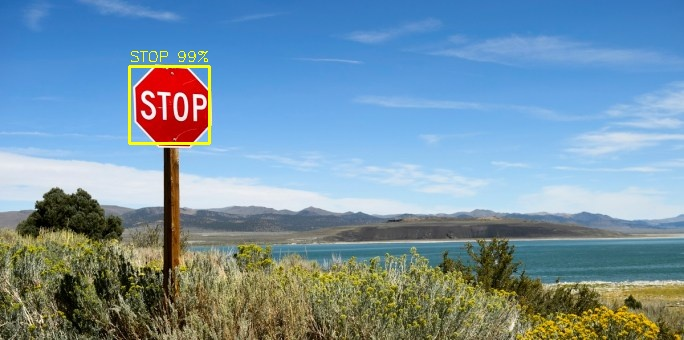
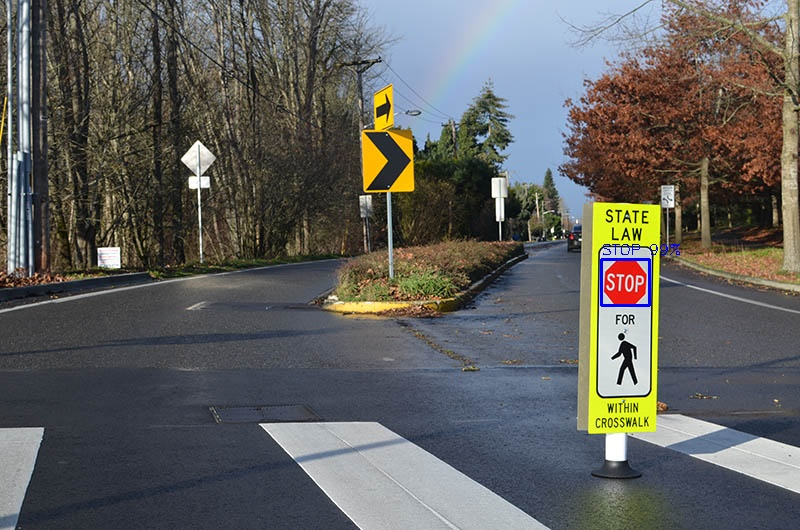
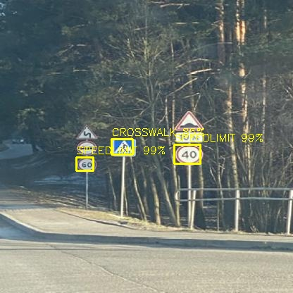
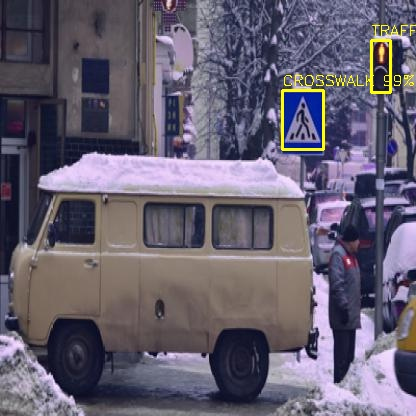
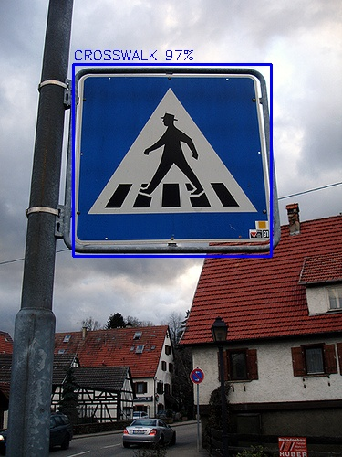
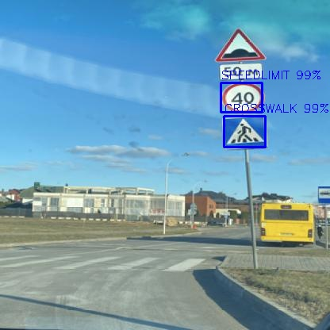
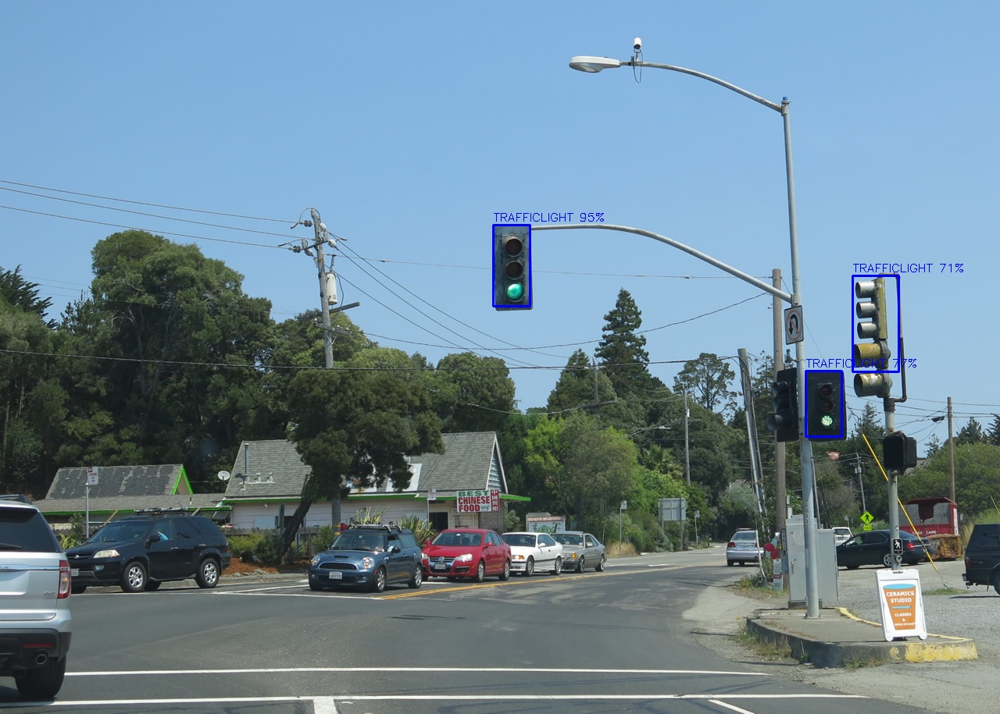

# Traffic Signs Detection using YoloV4 custom object detection and OpenCV DNN.

This repository contains my upgraded version of [using YoloV3 with OpenCV DNN to detect objects](https://github.com/fredotran/yolov3-opencvdnn) by training a YoloV4 model to recognize and detect **4 specific classes of traffic signs** : 

* Traffic lights.
* Speedlimit.
* Crosswalk.
* Stop signs.

The photos for this dataset were taken by [Erik Mclean](https://unsplash.com/@introspectivedsgn) (big thanks to him).

---

## About the dataset.

### Images.
This [dataset](https://www.kaggle.com/andrewmvd/road-sign-detection) contains **877 images** of **4 distinct classes** for the purpose of road sign detection.
Bounding box annotations were provided in the **PASCAL VOC format**, I transformed the data in **YoloV4 format** to make it easier for this project (using [roboflow](https://roboflow.com/)), you can download my YOLOv4 format version of the dataset **[here](https://github.com/fredotran/traffic-signs-detection/releases/download/weights/Traffic.Road.Signs.YoloV3.format.v2-10-01-2021.darknet.zip)**. 

### Labels.

Each images contained in the training, test and validation sets are labelled using the YoloV4 Format **i.e** : 
* One row per object
* Each row is `confidenceProbability, x_center, y_center, width, heigh, classProbability...`
* If there is more than one class, each row will be `confidenceProbability, x_center, y_center, width, heigh, (1st)classProbability, (2nd)classProbability...(k)classProbability.`

--- 

## Requirements.

* [Cmake](https://cmake.org/runningcmake/)
* [OpenCV 4.0 or higher](https://opencv.org/releases/) 
* [CUDA 11.0 or higher](https://developer.nvidia.com/cuda-toolkit-archive) 
* [cuDNN 7.0 or higher](https://developer.nvidia.com/rdp/cudnn-archive) 
* [Python3 or higher](https://www.python.org/downloads/)
* [Visual Studio 15 and higher](https://visualstudio.microsoft.com/fr/downloads/)
* Windows OS (I haven't tried on other OS)
* [GPU with CudaCompiler](https://en.wikipedia.org/wiki/CUDA#GPUs_supported)
* Lot of patience (but worth it)

To make custom training with YoloV4, we'll need first **to setup our working environment**. To make it easier for people to use, I developped some **utilities python files allowing** the automatisation of this process. So basically, all you'll need to do it's to launch the console (Windows Shell) and execute the commands in the **Python console** (it's not that hard I promise you). 

--- 

## YoloV4 weights, darknet and OpenCV DNN (GPU) setups.

I'll present two ways to do custom training model for this particular detection task : (**Local version**) and **(Easier/cloud version)**. The first one will need to do every steps of installation directly in your code folder (locally), the second one is much easier because everything is done in **[Colab](https://colab.research.google.com/)**.

### **Local version** : 

Before all, you'll first need to install and setup [OpenCV with a GPU back-end](https://medium.com/analytics-vidhya/build-opencv-from-source-with-cuda-for-gpu-access-on-windows-5cd0ce2b9b37), as we will need [OpenCV DNN GPU-enabled](https://learnopencv.com/how-to-use-opencv-dnn-module-with-nvidia-gpu-on-windows/) module : this is **mandatory**.  

* **If you want to train your own model** for this detection task you can do it as following :  
After the OpenCV installation in the root folder containing your `traffic-signs-detection` folder, you'll have to install and compile **[the darknet YoloV4](https://github.com/AlexeyAB/darknet)** algorithm in your workspace by doing these setups tutorial : [if you want to use cmake](https://github.com/AlexeyAB/darknet#how-to-compile-on-windows-using-cmake), and this one [if you want to use vcpkg](https://github.com/AlexeyAB/darknet#how-to-compile-on-windows-using-vcpkg). All the steps to setup and train your custom model are very well explained in [AlexeyAB repository](https://github.com/AlexeyAB/darknet) so I will not going in details here. The `backup` folder generated will store your trained weights.

* **If you want to use my pre-trained weights** you can simply open a ` Windows Command Prompt`, go to the `traffic-signs-detection` folder and type the **following command** : `python3 download_weights.py`.  
It will call this **[python file](https://github.com/fredotran/traffic-signs-detection/blob/main/download_weights.py)** and launches the instructions inside. This command will download automatically the weights provided [here](https://github.com/fredotran/traffic-signs-detection/releases) and put them in the `weights` folder directly. You'll be able to manipulate the weights to do everything you want with them.

### **Easier/cloud version** : 

You can also use this **[Google Colab notebook](https://colab.research.google.com/drive/1WcBZGXvFGsOacyXI4U0OI4_bgUsX2pdG#scrollTo=NjKzw2TvZrOQ)** if you do not have enough computational ressources to perform the training. The `backup` folder will contain your trained weights, you'll juste need to collect them after enough training of your model.

--- 

## Train, validation and test sets (data) setups.

(**Local version**) : I'm providing the dataset **[here](https://github.com/fredotran/traffic-signs-detection/releases/download/weights/Traffic.Road.Signs.YoloV3.format.v2-10-01-2021.darknet.zip)**, if you want to do the splitting, parsing of the train, validation and test sets and extracting the files manually. 

/!\ **In case of laziness** /!\ (*I know this feeling quite well*), I did "**two little scripts**" : [download_sets.py](https://github.com/fredotran/traffic-signs-detection/blob/main/download_sets.py) and [setup_sets.py](https://github.com/fredotran/traffic-signs-detection/blob/main/setup_sets.py) to automate the downloading, extracting and splitting into training, validation and test sets.

If you want to use my scripts, just open ` Windows Command Prompt`, go to the `traffic-signs-detection` folder and type the following commands by order : 
* `python3 download_sets.py` : it will download the datasets and extract them in the `traffic-signs-detection` folder.
* `python3 setup_sets.py` : this one will split and copy the **images** and **labels** in the proper folders ([more infos here](https://github.com/AlexeyAB/darknet#how-to-train-to-detect-your-custom-objects)).

**After doing all these steps, you're ready to train your custom model using the downloaded [pre-trained YoloV4 weights](https://github.com/AlexeyAB/darknet/releases/download/darknet_yolo_v3_optimal/yolov4.conv.137) !**

---

## Training and evaluate our custom model.

(**Local version**) : Now, you can start to train our custom model. In order to see if your [darknet installation](https://github.com/AlexeyAB/darknet) is working on Windows. To do that, you'll just have to launch a `Windows PowerShell Console`, go to the `traffic-signs-detection` folder and type the following command : 
* `.\darknet.exe detector train ../data/obj.data ../cfg/[CONFIG].cfg ../weights/[WEIGHTS].weights -map` 

Needlessly to tell you to replace `CONFIG` and `WEIGHTS` by the **own** names you gave to these files ([more infos here](https://github.com/AlexeyAB/darknet#when-should-i-stop-training)).

To test your custom model, this is the same steps to do than training but instead you have to enter this command : 
* `.\darknet.exe detector test ../data/obj.data ../cfg/[CONFIG].cfg ../weights/[WEIGHTS].weights -map` 

(Again) needlessly to tell you to replace `CONFIG` and `WEIGHTS` by the **own** names you gave to these files ([more infos here](https://github.com/AlexeyAB/darknet#custom-object-detection)).

---
## Model performance and results.

Using the [weights](https://github.com/fredotran/traffic-signs-detection/releases/download/weights/yolov4-rds_best_2000.weights) provided in this repository, the model achieved an **accuracy mAp @0.5 of 95.13%** (*it tooks ~ 2000 iterations*) on classification and detection of the 4 different traffic road signs classes.

---

## Notebooks.

In case or you want to test the custom model using **Jupyter Notebooks**, I'm providing two notebooks [for images testings](https://github.com/fredotran/traffic-signs-detection/blob/main/yolov4-traffic_road_signs-detection-images.ipynb) and [for videos testings](https://github.com/fredotran/traffic-signs-detection/blob/main/yolov4-traffic_road_signs-detection-videos.ipynb).

The [`inputs`](https://github.com/fredotran/traffic-signs-detection/tree/main/inputs) folder contains images and videos for testing your custom model, feel free to add more images/videos you're finding relevant ! The [`results`](https://github.com/fredotran/traffic-signs-detection/tree/main/results) folder contains the outputs of our custom model when we input images and videos from the `inputs` folder.

Using the notebooks for images, we can show some of the results : 

  
 
 

---

## About.

This work project is the continuation of my first project combining [YoloV3 and OpenCV DNN](https://github.com/fredotran/yolov3-opencvdnn), I wanted to push furthermore and train the model only on specific categories for this particular detection task.

--- 

## Acknowledgements.

Thank you Joseph Redmon and Ali Farhadi for their incredible work on **YOLO object detector** : **[YOLOv3: An Incremental Improvement](https://arxiv.org/abs/1804.02767)**, *Redmon, Joseph and Farhadi, Ali* ; arXiv, 2018.

Thank you AlexeyAB for your repository : **[YOLOv4 improvement](https://github.com/AlexeyAB/darknet)**

Thank you Andrew Mvd for your dataset : [Kaggle profile](https://www.kaggle.com/andrewmvd)
